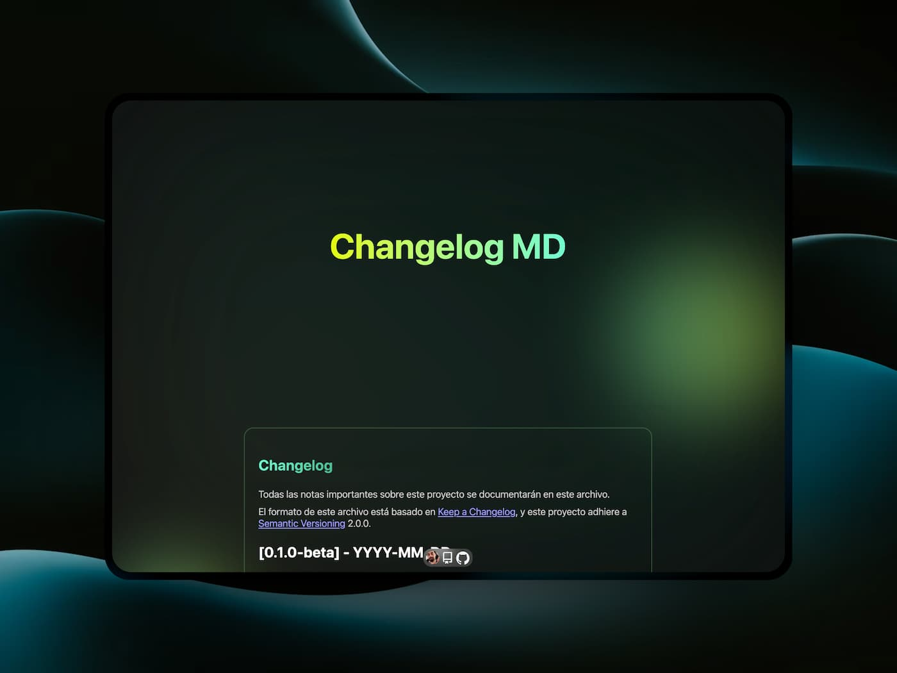

# Crear changelog
Es algo muy relevante si necesitas gestionar un registro claro de los cambios realizados sobre tu proyecto.
De este modo tendrás claridad de lo que resuelve, introduce y entregas cada versionado de tu proyecto desde una beta, pasando a minor y llegar a una versión estable.

Con cariño desde un rincon de 🇨🇱 para el 🌎

  

## Tecnologías
- [Zero-md](https://github.com/zerodevx/zero-md) - Renderizar markdown en HTML - [🚀 Documentación](zerodevx.github.io/zero-md/)
- [CSS](https://developer.mozilla.org/es/docs/Web/CSS) - Hojas de estilo en cascada - [🚀 Documentación](https://developer.mozilla.org/es/docs/Web/CSS)
- [HTML](https://developer.mozilla.org/es/docs/Web/HTML) - Lenguaje de marcado de hipertexto - [🚀 Documentación](https://developer.mozilla.org/es/docs/Web/HTML)
